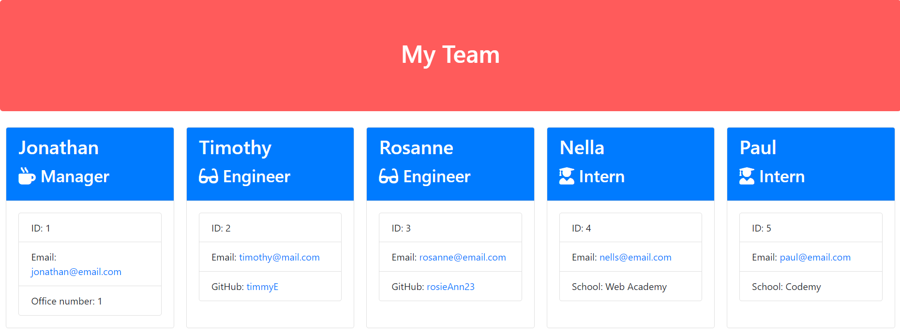

# TeamProfile-Composer

## Description
This repo contains a Node.js command-line application which takes information about employees on a software engineering team and generates an HTML webpage that displays summaries for each person.

The application accepts user input to gather information about the development team members and creates objects for each team member using the correct classes as blueprints.

Technologies used include the inquirer, joi and jest packages, html, css, javascript, classes and inheritance subclasses.

## Installation

Please use the following steps to install the application: 
1. Using your preferred code editor, copy the code from this link: . 
2. Create an index.js file and paste the code within. 
3. Save the file. 
4. Open a terminal window and enter the following commands: 
```bash
npm init -y
npm install inquirer@8.2.5
npm install joi
```

## Usage 
1. Right click on the index.js file and select **Open in Integrated Terminal** 
2. In the opened terminal window, type the command ```index.js``` to start the application.
3. Then enter the **team manager**’s details as prompted:
    * Name
    * Employee ID
    * Email address
    * Office number
4. You will then be presented with an option menu for selecting the other team members and/or completing the team build. Use the Up and down keys on your keyboard to select the required team members and enter the details as prompted.
    * The **team engineer**’s:
      * Name
      * Employee ID
      * Email address
      * GitHub username
    * The **intern**’s:
      * Name
      * Employee ID
      * Email address
      * School
6. When you have completed building the team, select **Finish building the team**.
7. The message **HTML file generated successfully!** will then be displayed indicated that the team build was a success.
8. A file named `team.html` will then be created in the `output` folder.
9. Open the `team.html` file to view the newly created team's basic info.
    * Right click the `team.html` file and select **Open with Live Server** or **Open with Default Browser**.
10. A screenshot of the generated HTML’s appearance and functionality can be seen below:



## Credits
The resources used for the development of this application are listed below:
  - https://joi.dev/api/?v=17.8.1
  - https://www.geeksforgeeks.org/node-js-path-resolve-method/
  - https://www.npmjs.com/package/inquirer
  - https://youtu.be/M-X23b2AMgg 
  - https://www.geeksforgeeks.org/async-await-function-in-javascript/
  - https://www.softwaretestinghelp.com/jest-testing-tutorial/

## License
Licensed by [MIT](https://img.shields.io/badge/License-MIT-yellow.svg) 
  